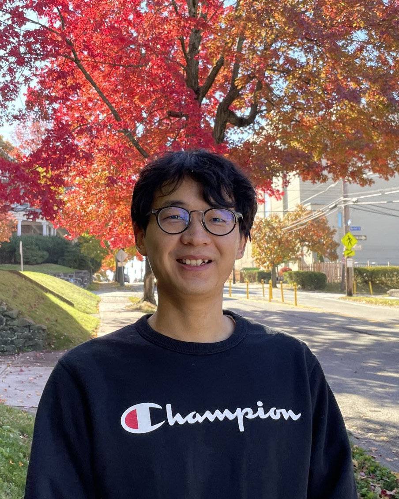

::: {#top .hero-wrap}
::: {.content-shell .hero-grid}
::: {.hero-copy}

Applied Mathematics • Numerical Analysis • Scientific Computing

# Shiheng Zhang

Postdoctoral Researcher, Department of Applied Mathematics, University of Washington

I work on numerical analysis, kinetic equations, and dynamical low-rank approximation, with an emphasis on structure-preserving algorithms for scientific computing.

::: {.hero-tags}
`Numerical analysis`
`Kinetic equations`
`Dynamical low-rank approximation`
`Scientific computing`
:::

::: {.hero-actions}
[Download CV](files/Shiheng_Zhang_CV.pdf){.action-button .action-primary}
[Google Scholar](https://scholar.google.com/citations?user=hKh5DZcAAAAJ&hl){.action-button .action-secondary}
[Selected papers](#publications){.action-button .action-secondary}
:::

::: {.detail-grid}
::: {.detail-item}
**Email**  
[shzhang3@uw.edu](mailto:shzhang3@uw.edu)
:::

::: {.detail-item}
**Current affiliation**  
[University of Washington](https://amath.washington.edu/people/shiheng-zhang)
:::

::: {.detail-item}
**Recent update**  
Boeing Research Award, 2025
:::

::: {.detail-item}
**Links**  
[UW profile](https://amath.washington.edu/people/shiheng-zhang) · [GitHub](https://github.com/shzhang3)
:::
:::
:::

::: {.hero-media}
{.hero-image fig-alt="Portrait of Shiheng Zhang"}
:::
:::
:::

## Research {#research}

::: {.section-shell}
::: {.content-shell}
::: {.split-grid}
::: {.stack-block}
### Current Focus

- Structure-preserving schemes for kinetic equations and Wasserstein gradient flows
- Dynamical low-rank methods for stiff and multiscale PDEs
- Reliable numerical algorithms with strong stability and asymptotic properties
:::

::: {.stack-block}
### Background

  
2024–present

  
Postdoctoral Researcher in Applied Mathematics at the University of Washington, working with <a href="https://jingweihu-math.github.io/webpage/">Jingwei Hu</a>.

  
2023

  
Ph.D. in Mathematics, Purdue University, advised by <a href="https://www.math.purdue.edu/~shen7/">Jie Shen</a>.

  
2019

  
B.S. in Mathematics, Southern University of Science and Technology, advised by <a href="https://faculty.sustech.edu.cn/?tagid=yangj7&orderby=date&iscss=1&snapid=1&go=2&lang=en">Jiang Yang</a> and <a href="http://maths.nju.edu.cn/~hebma/">Bingsheng He</a>.

:::
:::
:::
:::

## Selected Publications {#publications}

::: {.section-shell .section-alt}
::: {.content-shell}

A few recent papers most representative of my current research directions. For the full list, see <a href="https://scholar.google.com/citations?user=hKh5DZcAAAAJ&hl">Google Scholar</a>.

::: {.publication-list}
::: {.publication-item}
::: {.pub-year}
2026
:::
::: {.pub-body}
**[A separable and asymptotic-preserving dynamical low-rank method for the Vlasov--Poisson--Fokker--Planck System](https://doi.org/10.1051/m2an/2026047)**  
Shiheng Zhang and Jingwei Hu · ESAIM: M2AN
:::
:::

::: {.publication-item}
::: {.pub-year}
2025
:::
::: {.pub-body}
**[On the stability of the low-rank projector-splitting integrators for hyperbolic and parabolic equations](https://arxiv.org/abs/2507.15192)**  
Shiheng Zhang and Jingwei Hu · arXiv preprint
:::
:::

::: {.publication-item}
::: {.pub-year}
2025
:::
::: {.pub-body}
**[Asymptotic-Preserving Dynamical Low-Rank Method for the Stiff Nonlinear Boltzmann Equation](https://www.sciencedirect.com/science/article/pii/S002199912500395X)**  
Lukas Einkemmer, Jingwei Hu, and Shiheng Zhang · Journal of Computational Physics
:::
:::

::: {.publication-item}
::: {.pub-year}
2025
:::
::: {.pub-body}
**[Low-Rank Adaptation of Evolutionary Deep Neural Networks for Efficient Learning of Time-Dependent PDEs](https://arxiv.org/abs/2509.16395)**  
Jiahao Zhang, Shiheng Zhang, and Guang Lin · arXiv preprint
:::
:::

::: {.publication-item}
::: {.pub-year}
2025
:::
::: {.pub-body}
**[SAV-based entropy-dissipative schemes for a class of kinetic equations](http://math.purdue.edu/~shen7/pub/ZSH_SISC25.pdf)**  
Shiheng Zhang, Jie Shen, and Jingwei Hu · SIAM Journal on Scientific Computing
:::
:::

::: {.publication-item}
::: {.pub-year}
2025
:::
::: {.pub-body}
**[Structure preserving schemes for a class of Wasserstein gradient flows](https://link.springer.com/article/10.1007/s42967-025-00486-2)**  
Shiheng Zhang and Jie Shen · Communications on Applied Mathematics and Computation
:::
:::

::: {.publication-item}
::: {.pub-year}
2025
:::
::: {.pub-body}
**[A Relaxed Vector Auxiliary Variable Algorithm for Unconstrained Optimization Problems](https://epubs.siam.org/doi/10.1137/23M1611087)**  
Shiheng Zhang, Jiahao Zhang, Jie Shen, and Guang Lin · SIAM Journal on Scientific Computing
:::
:::

::: {.publication-item}
::: {.pub-year}
2024
:::
::: {.pub-body}
**[Energy-dissipative evolutionary deep operator neural networks](https://www.sciencedirect.com/science/article/abs/pii/S0021999123007337)**  
Jiahao Zhang, Shiheng Zhang, Jie Shen, and Guang Lin · Journal of Computational Physics
:::
:::
:::
:::
:::

## Talks {#talks}

::: {.section-shell}
::: {.content-shell}
::: {.split-grid}
::: {.stack-block}
### Selected Talks

- **On the stability of the low-rank projector-splitting integrator for parabolic equations**, CHaRMNET Annual Meeting, University of Washington, December 2025
- **Structure preserving schemes for a class of Wasserstein gradient flows**, SIAM Annual Meeting, Spokane, July 2024
- **A Relaxed Vector Auxiliary Variable Algorithm for Unconstrained Optimization Problems**, SIAM Conference on Optimization, Seattle, June 2023
:::

::: {.stack-block}
### Selected Posters

- **SAV-based entropy-dissipative schemes for a class of kinetic equations**, ICERM, Providence, July 2025
- **Asymptotic-Preserving Dynamical Low-Rank Method for the Stiff Nonlinear Boltzmann Equation**, CHaRMNET Annual Meeting, Virginia Tech, December 2024
- **SAV-based entropy-dissipative schemes for a class of kinetic equations**, NSF Computational Mathematics PI Meeting, University of Washington, July 2024
:::
:::
:::
:::

## Teaching {#teaching}

::: {.section-shell .section-alt}
::: {.content-shell}
::: {.split-grid}
::: {.stack-block}
### Instructor

- **AMATH 351 A and B** · Introduction to Differential Equations and Applications · Spring 2026
- **AMATH 352 B** · Applied Linear Algebra and Numerical Analysis · Winter 2026
- **AMATH 351 A** · Introduction to Differential Equations and Applications · Spring 2025
- **AMATH 352 B** · Applied Linear Algebra and Numerical Analysis · Winter 2025
- **AMATH 351 A** · Introduction to Differential Equations and Applications · Spring 2024
:::

::: {.stack-block}
### Teaching Assistant

- **MA 265** · Linear Algebra
- **MA 266** · Ordinary Differential Equations
- **MA 261** · Multivariate Calculus
- **MA 162** · Calculus II
- **MA 161** · Calculus I
:::
:::
:::
:::

## Contact {#contact}

::: {.section-shell}
::: {.content-shell}
::: {.contact-panel}
### Get in Touch

I am always happy to hear from people working in numerical analysis, kinetic equations, structure-preserving computation, and low-rank methods.

::: {.contact-links}
[Email](mailto:shzhang3@uw.edu){.action-button .action-primary}
[UW Profile](https://amath.washington.edu/people/shiheng-zhang){.action-button .action-secondary}
[GitHub](https://github.com/shzhang3){.action-button .action-secondary}
:::
:::
:::
:::
