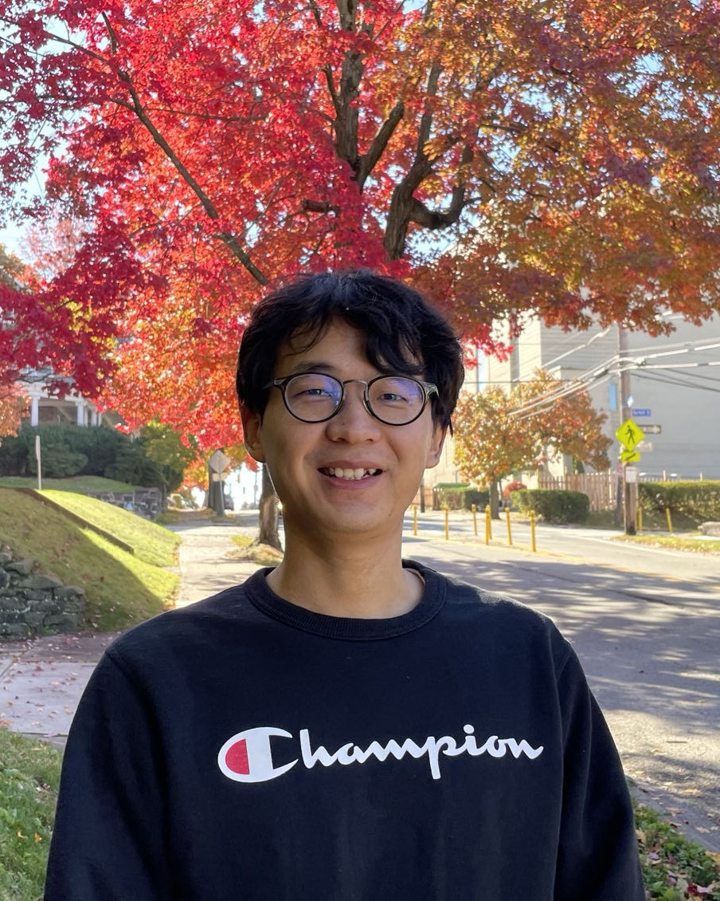

::: {#top .hero-wrap}
::: {.content-shell .hero-grid}
::: {.hero-copy}

Numerical PDEs and Scientific Computing

# Shiheng Zhang

Pearson Fellow and Acting Instructor, Department of Applied Mathematics, University of Washington

I develop and analyze numerical methods for high-dimensional and multiscale PDEs. My work focuses on low-rank approximation, robust time integration, and structure-preserving schemes for kinetic and dissipative equations.

::: {.hero-tags}
`High-dimensional and multiscale PDEs`
`Low-rank approximation`
`Time integration`
`Structure-preserving methods`
:::

::: {.hero-actions}
[Download CV](files/Shiheng_Zhang_CV.pdf){.action-button .action-primary}
[Google Scholar](https://scholar.google.com/citations?user=hKh5DZcAAAAJ&hl){.action-button .action-secondary}
[Selected papers](#publications){.action-button .action-secondary}
[Research software](#software){.action-button .action-secondary}
:::

::: {.detail-grid}
::: {.detail-item}
**Email**  
[shzhang3@uw.edu](mailto:shzhang3@uw.edu)
:::

::: {.detail-item}
**Current appointment**\
Pearson Fellow and Acting Instructor, [University of Washington](https://amath.washington.edu/people/shiheng-zhang)
:::

::: {.detail-item}
**Recent update**  
Boeing Research Award, 2025
:::

::: {.detail-item}
**Links**  
[UW profile](https://amath.washington.edu/people/shiheng-zhang) · [GitHub](https://github.com/shzhang3) · [LinkedIn](https://www.linkedin.com/in/shihengzhang/)
:::
:::
:::

::: {.hero-media}
{.hero-image fig-alt="Portrait of Shiheng Zhang"}
:::
:::
:::

## Research {#research}

::: {.section-shell}
::: {.content-shell}
::: {.split-grid}
::: {.stack-block}
### Current Focus

- Robust low-rank approximation and high-order time integration
- Structure-preserving and asymptotic-preserving methods for kinetic equations
- Energy- and entropy-stable schemes for dissipative PDEs
:::

::: {.stack-block}
### Background

  
2024–present

  
Pearson Fellow and Acting Instructor in Applied Mathematics at the University of Washington, working with <a href="https://jingweihu-math.github.io/webpage/">Jingwei Hu</a>.

  
2023

  
Ph.D. in Mathematics, Purdue University, advised by <a href="https://www.math.purdue.edu/~shen7/">Jie Shen</a>.

  
2019

  
B.S. in Mathematics, Southern University of Science and Technology, advised by <a href="https://faculty.sustech.edu.cn/?tagid=yangj7&orderby=date&iscss=1&snapid=1&go=2&lang=en">Jiang Yang</a> and <a href="http://maths.nju.edu.cn/~hebma/">Bingsheng He</a>.

:::
:::
:::
:::

## Selected Work {#publications}

::: {.section-shell .section-alt}
::: {.content-shell}

A few recent papers most representative of my current research directions. For the full list, see <a href="https://scholar.google.com/citations?user=hKh5DZcAAAAJ&hl">Google Scholar</a>.

### Publications {.publication-group-title}

::: {.publication-list}
::: {.publication-item}
::: {.pub-year}
2026
:::
::: {.pub-body}
**[Ordinal geometry complements reconstruction: diagnosing planning with compressed value functions](https://openreview.net/forum?id=QbTBLTxehl)**

**Shiheng Zhang** · Advances in Neural Information Processing Systems (NeurIPS 2026)
:::
:::

::: {.publication-item}
::: {.pub-year}
2026
:::
::: {.pub-body}
**[On the stability of the low-rank projector-splitting integrator for hyperbolic and parabolic equations](https://link.springer.com/article/10.1007/s10915-026-03464-9)**

**Shiheng Zhang** and Jingwei Hu · Journal of Scientific Computing
:::
:::

::: {.publication-item}
::: {.pub-year}
2026
:::
::: {.pub-body}
**[A separable and asymptotic-preserving dynamical low-rank method for the Vlasov--Poisson--Fokker--Planck system](https://doi.org/10.1051/m2an/2026047)**

**Shiheng Zhang** and Jingwei Hu · ESAIM: M2AN
:::
:::

::: {.publication-item}
::: {.pub-year}
2025
:::
::: {.pub-body}
**[SAV-based entropy-dissipative schemes for a class of kinetic equations](http://math.purdue.edu/~shen7/pub/ZSH_SISC25.pdf)**

**Shiheng Zhang**, Jie Shen, and Jingwei Hu · SIAM Journal on Scientific Computing
:::
:::

::: {.publication-item}
::: {.pub-year}
2025
:::
::: {.pub-body}
**[Asymptotic-preserving dynamical low-rank method for the stiff nonlinear Boltzmann equation](https://www.sciencedirect.com/science/article/pii/S002199912500395X)**

Lukas Einkemmer, Jingwei Hu, and **Shiheng Zhang** · Journal of Computational Physics
:::
:::

::: {.publication-item}
::: {.pub-year}
2025
:::
::: {.pub-body}
**[Structure preserving schemes for a class of Wasserstein gradient flows](https://link.springer.com/article/10.1007/s42967-025-00486-2)**

**Shiheng Zhang** and Jie Shen · Communications on Applied Mathematics and Computation
:::
:::

::: {.publication-item}
::: {.pub-year}
2025
:::
::: {.pub-body}
**[A relaxed vector auxiliary variable algorithm for unconstrained optimization problems](https://epubs.siam.org/doi/10.1137/23M1611087)**

**Shiheng Zhang**&#42;, Jiahao Zhang&#42;, Jie Shen, and Guang Lin · SIAM Journal on Scientific Computing

&#42;Equal contribution
:::
:::

::: {.publication-item}
::: {.pub-year}
2024
:::
::: {.pub-body}
**[Energy-dissipative evolutionary deep operator neural networks](https://www.sciencedirect.com/science/article/abs/pii/S0021999123007337)**

Jiahao Zhang&#42;, **Shiheng Zhang**&#42;, Jie Shen, and Guang Lin · Journal of Computational Physics

&#42;Equal contribution
:::
:::
:::

### Preprints {.publication-group-title}

::: {.publication-list}
::: {.publication-item}
::: {.pub-year}
2026
:::
::: {.pub-body}
**[Robust high-order projector-splitting integrators](https://arxiv.org/abs/2608.17157)**

**Shiheng Zhang** and Jingwei Hu · arXiv preprint
:::
:::

::: {.publication-item}
::: {.pub-year}
2026
:::
::: {.pub-body}
**[A counterexample to robust second-order convergence of the Strang projector-splitting integrator](https://arxiv.org/abs/2608.12893)**

**Shiheng Zhang** · arXiv preprint · Submitted
:::
:::

::: {.publication-item}
::: {.pub-year}
2026
:::
::: {.pub-body}
**[Guidance breaks the fitted operator: a terminal-fitted repair for classifier-free guidance](https://arxiv.org/abs/2607.07665)**

**Shiheng Zhang** · arXiv preprint · Submitted
:::
:::

::: {.publication-item}
::: {.pub-year}
2026
:::
::: {.pub-body}
**[Asymptotic preservation and uniform accuracy of diffusion and flow-matching samplers](https://arxiv.org/abs/2607.04113)**

**Shiheng Zhang** · arXiv preprint
:::
:::

::: {.publication-item}
::: {.pub-year}
2026
:::
::: {.pub-body}
**[SAV schemes with decomposition-induced pullback corrections for gradient flows](https://arxiv.org/abs/2606.18551)**

**Shiheng Zhang** and Jie Shen · arXiv preprint · Submitted
:::
:::

::: {.publication-item}
::: {.pub-year}
2026
:::
::: {.pub-body}
**[Planner-admissible graph-PDE value extensions for sparse goal-conditioned planning](https://arxiv.org/abs/2605.19185)**

**Shiheng Zhang** · arXiv preprint · Submitted
:::
:::

::: {.publication-item}
::: {.pub-year}
2025
:::
::: {.pub-body}
**[Low-rank adaptation of evolutionary deep neural networks for efficient learning of time-dependent PDEs](https://arxiv.org/abs/2509.16395)**

Jiahao Zhang, **Shiheng Zhang**, and Guang Lin · arXiv preprint · Submitted
:::
:::
:::
:::
:::

## Research Software {#software}

::: {.section-shell}
::: {.content-shell}

Open implementations and reproducible experiments accompanying my work in dynamical low-rank approximation, kinetic equations, and structure-preserving optimization.

::: {.software-grid}
::: {.software-item}
### DLRA

A modular Python solver for full and dynamical low-rank simulations of the stiff nonlinear Boltzmann equation, with a command-line interface, tests, and reproducible examples.

::: {.software-links}
[GitHub](https://github.com/shzhang3/DLRA) · [Paper](https://www.sciencedirect.com/science/article/pii/S002199912500395X)
:::
:::

::: {.software-item}
### DLR-VPFP

JAX implementations, experiment configurations, and figure-generation scripts for the separable asymptotic-preserving VPFP method.

::: {.software-links}
[GitHub](https://github.com/shzhang3/DLR-VPFP) · [Paper](https://doi.org/10.1051/m2an/2026047)
:::
:::

::: {.software-item}
### RVAV

A PyTorch implementation of the relaxed vector auxiliary variable optimizer, with a drop-in optimizer API, tests, continuous integration, and a quick start.

::: {.software-links}
[GitHub](https://github.com/shzhang3/RVAV) · [Paper](https://epubs.siam.org/doi/10.1137/23M1611087)
:::
:::
:::
:::
:::

## Talks {#talks}

::: {.section-shell}
::: {.content-shell}
::: {.split-grid}
::: {.stack-block}
### Selected Talks

- **Robust projector-splitting Runge-Kutta integrators of orders two and three**, SIAM Conference on Computational Science and Engineering (CSE27), Pittsburgh, February 2027 (upcoming)
- **On the stability of the low-rank projector-splitting integrator for parabolic equations**, CHaRMNET Annual Meeting, University of Washington, December 2025
- **Structure preserving schemes for a class of Wasserstein gradient flows**, SIAM Annual Meeting, Spokane, July 2024
- **A relaxed vector auxiliary variable algorithm for unconstrained optimization problems**, SIAM Conference on Optimization, Seattle, June 2023
:::

::: {.stack-block}
### Selected Posters

- **A separable and asymptotic-preserving dynamical low-rank method for the Vlasov--Poisson--Fokker--Planck system**, IPAM, UCLA, Los Angeles, March 2026
- **SAV-based entropy-dissipative schemes for a class of kinetic equations**, ICERM, Providence, July 2025
- **Asymptotic-preserving dynamical low-rank method for the stiff nonlinear Boltzmann equation**, CHaRMNET Annual Meeting, Virginia Tech, December 2024
- **SAV-based entropy-dissipative schemes for a class of kinetic equations**, NSF Computational Mathematics PI Meeting, University of Washington, July 2024
:::
:::

### Conference Organization

**Co-organizer**, minisymposium: *Low-Rank and Tensor Methods for High-Dimensional PDEs*, SIAM Conference on Computational Science and Engineering (CSE27), Pittsburgh, February 2027 (upcoming).
:::
:::

## Teaching {#teaching}

::: {.section-shell .section-alt}
::: {.content-shell}

<strong>AMATH 351 · Autumn 2026:</strong> Explore <a href="https://shzhang3.github.io/amath351-lab/">AMATH 351 Lab</a>, an interactive course project. The first experiment connects direction fields, initial conditions, and solution curves. <a href="https://github.com/shzhang3/amath351-lab">Source on GitHub</a>.

::: {.split-grid}
::: {.stack-block}
### Instructor

- **AMATH 351 A and B** · Introduction to Differential Equations and Applications · Spring 2026
- **AMATH 352 B** · Applied Linear Algebra and Numerical Analysis · Winter 2026
- **AMATH 351 A** · Introduction to Differential Equations and Applications · Spring 2025
- **AMATH 352 B** · Applied Linear Algebra and Numerical Analysis · Winter 2025
- **AMATH 351 A** · Introduction to Differential Equations and Applications · Spring 2024
:::

::: {.stack-block}
### Teaching Assistant

- **MA 265** · Linear Algebra
- **MA 266** · Ordinary Differential Equations
- **MA 261** · Multivariate Calculus
- **MA 162** · Calculus II
- **MA 161** · Calculus I
:::
:::
:::
:::

## Contact {#contact}

::: {.section-shell}
::: {.content-shell}
::: {.contact-panel}
### Get in Touch

I welcome conversations about numerical PDEs, scientific computing, low-rank approximation, and structure-preserving methods.

::: {.contact-links}
[Email](mailto:shzhang3@uw.edu){.action-button .action-primary}
[UW Profile](https://amath.washington.edu/people/shiheng-zhang){.action-button .action-secondary}
[GitHub](https://github.com/shzhang3){.action-button .action-secondary}
[LinkedIn](https://www.linkedin.com/in/shihengzhang/){.action-button .action-secondary}
:::
:::
:::
:::
